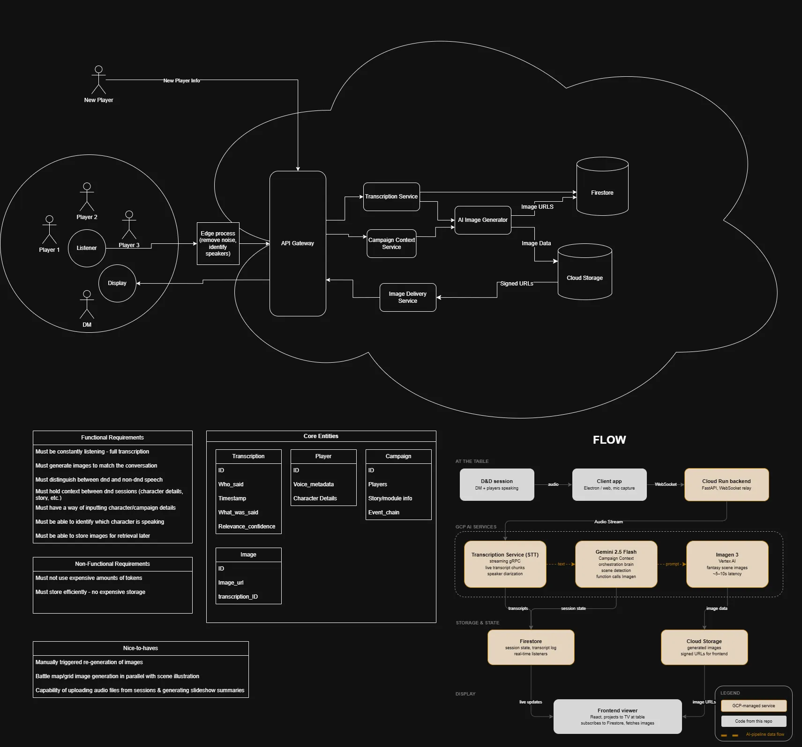

# DnD Listener

A constantly-listening AI tool that generates images on the fly during Dungeons & Dragons sessions to illustrate the story as it unfolds. Audio or game events are captured, sent to a cloud backend, and rendered in a live viewer that players and the DM can watch together.

## How it works



Audio is captured at the table, preprocessed locally (noise removal, speaker diarization), and streamed via WebSocket to a Cloud Run backend. From there:

1. **Transcription Service (STT)** — converts the audio stream to text chunks with speaker labels, storing transcripts in Firestore.
2. **Gemini 2.5 Flash** — acts as the orchestration brain: detects scene changes in the transcript and calls Imagen 3 when a new illustration is warranted.
3. **Imagen 3** — generates a fantasy scene image (~5–10s) and stores it in Cloud Storage.
4. **Image Delivery Service** — fetches signed URLs from Cloud Storage and pushes them back through the API Gateway to the display.
5. **Frontend viewer** — React app projectable to a TV at the table; subscribes to Firestore for live updates and fetches images via signed URLs.

## Stack

| Layer | Technology |
|-------|------------|
| Client | Python, httpx |
| Server | Python, FastAPI, uvicorn (Cloud Run) |
| Viewer | React 18, Vite, nginx |
| AI | Speech-to-Text (gRPC), Gemini 2.5 Flash, Imagen 3 (Vertex AI) |
| Storage | Firestore (state/transcripts), Cloud Storage (images) |
| Infra | GCP, Terraform, Docker |

## Local development

Prerequisites: Docker, or Python 3.12+ and Node 20+.

### Docker Compose (all services)
```bash
cd infra
docker compose up --build
```
- Server: http://localhost:8000
- Viewer: http://localhost:3000

### Running services individually

**Server**
```bash
cd server && pip install -r requirements.txt
cp .env.example .env
uvicorn app.main:app --reload
```

**Client**
```bash
cd client && pip install -r requirements.txt
cp .env.example .env        # set SERVER_URL if not localhost
python src/main.py
```

**Viewer**
```bash
cd viewer && npm install
npm run dev                  # http://localhost:5173, proxies /events → :8000
```

## Infrastructure (GCP)

Terraform configuration lives in `infra/`. Targets GCP — configure your provider and credentials before applying.

```bash
cd infra
terraform init
terraform plan -var="environment=dev"
terraform apply
```

## Extending the client

`GameEventListener` in `client/src/listener.py` is a base class. Subclass it and implement `watch()` to yield event dicts for your game source:

```python
class MyVTTListener(GameEventListener):
    async def watch(self):
        async for line in my_vtt_feed():
            yield {"type": "narrative", "source": "vtt", "payload": {"text": line}}
```
